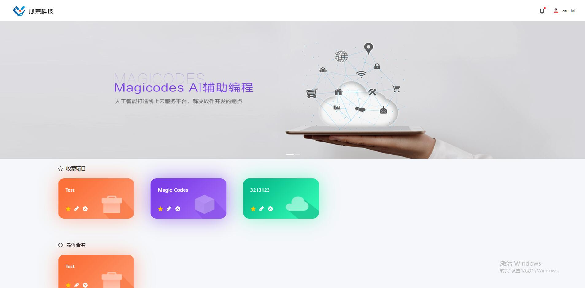
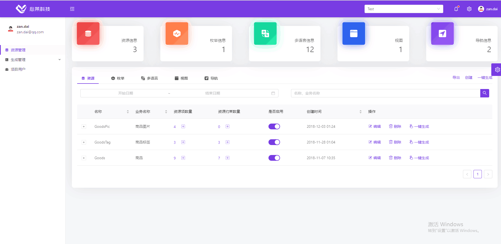
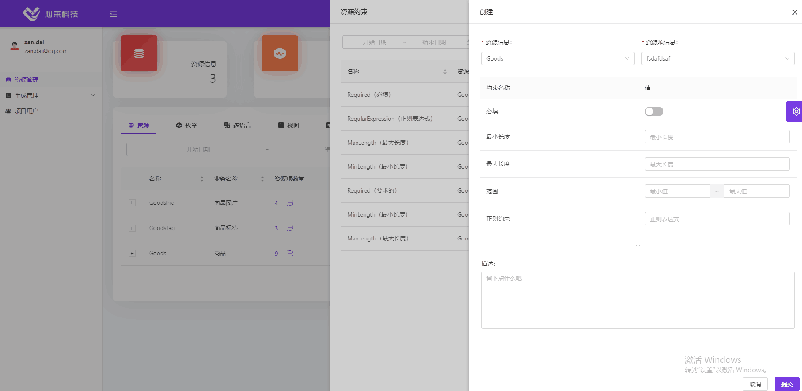

# Magicodes.Admin

<!--  -->
## 说明

Magicodes.Admin，是心莱科技团队打造的一套高效率、易扩展、基础设施强大、代码生成完备、理念和技术先进的敏捷开发框架，同时也是一套分布式、跨平台（**linux、Docker容器支持，已提供Docker教程、腾讯云容器托管教程、Azure DevOps教程**）、多终端（包括**Android、IOS、H5、小程序、微信公众号**）、前后端分离、持续集成（CI）、自动部署、监控支持的统一开发框架和开发解决方案。框架基于.NET Core 2.1、Angular、Ionic、EF Core、ABP和ASP.NET Zero，并在其基础上进行了封装和完善，并且编写了相关的工具（代码生成）、组件（云存储、支付、微信等等）、生成服务。

## 官方订阅号

关注“magiccodes”订阅号获取：

* 最新文章、教程、文档
* 视频教程
* 基础版免费授权
* 模板
* 解决方案
* 编程心得和理念

## 最新教程

* Docker最全教程——从理论到实战
<a href="https://mp.weixin.qq.com/mp/homepage?__biz=MzU0Mzk1OTU2Mg==&hid=4&sn=124ac42eadc134bb9598c4179dab9e54" target="_blank">
点此打开
</a>

* 产品开发相关
<a href="https://mp.weixin.qq.com/mp/homepage?__biz=MzU0Mzk1OTU2Mg==&hid=1&sn=11a42726eb1be358950f9273fd58f4c6" target="_blank">
点此打开
</a>

* 教程（包括录屏教程）
<a href="https://mp.weixin.qq.com/mp/homepage?__biz=MzU0Mzk1OTU2Mg==&hid=2&sn=ec7b6654e1ea65cfb854d345760ecafa" target="_blank">
点此打开
</a>

## 开发日志
https://gitee.com/xl_wenqiang/Magicodes.Admin.Core/commits/develop

## VNext

* 拆分架构和仓库,以便更易于使用
* 存储组件支持腾讯云存储
* 新版后台UI
* 微服务架构支持
* MySQL支持配置简化
* Docker支持阿里云（目前已经支持腾讯云容器服务）
* 小程序UI Demo
* 更多解决方案和案例
* 更多请访问：https://gitee.com/xl_wenqiang/Magicodes.Admin.Core/issues

正在进行以下拆分：
- 将App/UI迁移到 https://gitee.com/magicodes/Magicodes.App
- 小程序UI框架将 在https://gitee.com/magicodes/Magicodes.Miniprogram 添加
- 新版UI将在 https://gitee.com/magicodes/Magicodes.Admin.UI 搭建。

## 相关官方Nuget

| 名称     |      Nuget      |
|----------|:-------------:|
| Magicodes.Alipay  |   |
| Magicodes.Alipay.Global |       |
| Magicodes.Pay.WeChat |  |
| Magicodes.PayNotify |  |
| Magicodes.WeChat.MiniProgram |  |
| Magicodes.Sms.Aliyun |  |
| Magicodes.Storage.Core |  |
| Magicodes.Storage.AliyunOss.Core |  |
| Magicodes.Storage.Local.Core |  |
| Magicodes.Storage.Tencent.Core |  |
| Magicodes.WeChat.SDK.Core |  |
| Magicodes.SwaggerUI |  |
| Magicodes.ExporterAndImporter.Excel |  |
| Magicodes.ExporterAndImporter.Core |  |

## Demo

已通过腾讯云Docker容器托管，并且使用Azure Pipelines实现持续集成（CI）:

* 开发版（Develop分支）(可能会出现问题导致无法打开):
  * 后台：<https://devdemoadmin.xin-lai.com>
  * 后台接口：<https://devdemoadminapi.xin-lai.com> 
  <!-- * APP接口：<https://devdemoappapi.xin-lai.com> 
   -->

* 稳定版
  * 后台：<https://	demoadmin.xin-lai.com>
  * 后台接口：<https://demoadminapi.xin-lai.com> 
  <!-- * APP接口：<https://demoappapi.xin-lai.com>      -->

* 账号：Admin
* 密码：123456abcD

## 开发组件、套件、解决方案、理念

目前框架中包含以下开发组件、套件、解决方案、理念：

* 通用权限
* 多租户
* 版本
* 组织机构
* 多语言
* 审计日志（操作审计和数据审计）
* 缓存管理（支持内存和Redis）
* 日志（Log4net、**NLog**、**阿里云日志**）
* 设置管理器
* **短信服务（Magicodes.Sms【https://github.com/xin-lai/Magicodes.Sms】）**
* **支付、统一支付回调（使用Magicodes.Pay【https://github.com/xin-lai/Magicodes.Pay】，支持微信、支付宝、国际支付宝支付和分账）**
* **微信SDK（Magicodes.WeChat.SDK【https://github.com/xin-lai/Magicodes.WeChat.SDK】）**
* **小程序SDK（Magicodes.WeChat.SDK【https://github.com/xin-lai/Magicodes.WeChat.SDK】）**
* **微信扫码登录（Magicodes.WeChat.SDK【https://github.com/xin-lai/Magicodes.WeChat.SDK】）**
* 通用异常处理
* **领域驱动**
* **依赖注入**
* **接口权限以及授权**
* **在线接口文档（Magicodes.SwaggerUI+Swagger UI【https://github.com/xin-lai/Magicodes.SwaggerUI】）**
* 数据验证
* 调度任务（Quartz）
* 后台任务（Hangfire）
* 数据筛选器（租户筛选器、软删除、是否激活）
* **跨平台以及Docker支持（目前基于.NET Core 2.1），支持Visual Studio Tools for Docker**
* 通知系统
* **支持通过配置文件配置Kestrel服务器（比如启用HTTPS，以便更好地支持Docker）**
* **支持HTTPS重定向**
* **支持HTTP严格传输安全协议(HSTS)**
  * 在浏览器将会阻止通过 HTTP 发送的任何通信的域的配置存储。 在浏览器强制通过 HTTPS 进行的所有通信。
  * 在浏览器可防止用户使用不受信任或无效的证书。 在浏览器禁用允许用户暂时信任此证书的提示。
* **即时消息（SignalR）支持，并且支持Redis集群**
* ORM和数据迁移(Entity Framework Core)
* **通用导入导出（Magicodes.ExporterAndImporter【https://github.com/xin-lai/Magicodes.ExporterAndImporter】）**
* **通用存储（Magicodes.Storage，支持本地存储,阿里云存储,腾讯云存储【https://github.com/xin-lai/Magicodes.Storage】）**
* 全国行政区域抓取和初始化（Magicodes.Districts【https://github.com/xin-lai/Magicodes.Districts】）
* **移动端统一开发解决方案和模板（Angular+Ionic）**
* 前后端分离
* **后台前端解决方案和UI（Angular、primeng、bootstrap）**
* **简单CMS**
* **移动端通用接口（登陆注册找回密码等）**
* 邮件服务
* **移动端多语言支持**
* **交易流水以及多国货币支持**
* **大量后台UI组件（除了常用组件，还支持Tree Table、图片展示、文件批量上传、枚举下拉、关联项下拉、审计）**
* 单元测试（后台服务、移动端服务）
* **代码生成（后台服务、后台UI功能、多语言定义、权限定义、移动端服务）**
* **一键部署（后台服务、前台服务、后台前端）**
* **接口调用代码生成（nswag，后台前端和移动端前端）**
* **支持Dapper，作为ORM辅助库**
* **升级工具**
* **配套项目/产品开发流程（<https://gitee.com/xl_wenqiang/xinlai_devprocess>）**

加QQ群 **85318032** 获取最新动态和文档。

## 生成服务

 高级版附送代码生成工具以及相关源代码。**目前线上生成服务Beta版一上线，在内测阶段，仅提供给高级版客户。**

 界面预览:

## 推荐开发环境

已升级到到.NET Core 2.1，请先下载SDK：<https://www.microsoft.com/net/download/windows>

## 官方博客

<http://www.cnblogs.com/codelove/>

## 官方网址

<http://xin-lai.com>

## 其他开源库地址

<https://github.com/xin-lai>

## 相关QQ群

编程交流群<85318032>

产品交流群<897857351>

## 小店地址

<https://shop113059108.taobao.com/>