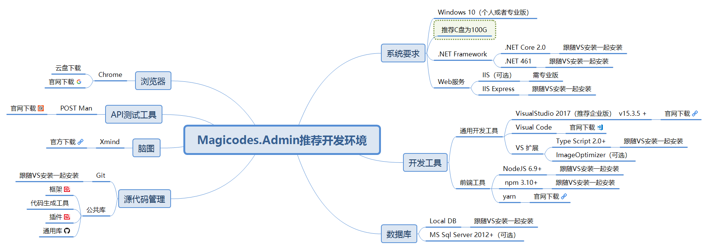

# Magicodes.Admin

<!--  -->
## 说明

Magicodes.Admin，是心莱科技团队打造的一套高效率、易扩展、基础设施强大、代码生成完备、理念和技术先进的敏捷开发框架，同时也是一套分布式（**即将提供微服务架构参考**）、跨平台（**linux、Docker容器支持，即将提供腾讯云容器托管教程**）、多终端（包括**Android、IOS、H5、小程序、微信公众号**）支持的统一开发框架和解决方案。框架基于.NET Core 2.1、Angular、Ionic、EF Core、ABP和ASP.NET Zero，并在其基础上进行了封装和完善，并且编写了相关的工具（代码生成）、组件（云存储、支付、微信等等）、生成服务。

## 官方订阅号

关注“magiccodes”订阅号获取：

* 最新文章、教程、文档
* 视频教程
* 基础版免费授权
* 模板
* 解决方案
* 编程心得和理念

## 开发日志
https://gitee.com/xl_wenqiang/Magicodes.Admin.Core/commits/develop

## VNext

* 拆分架构和仓库,以便更易于使用
* 存储组件支持腾讯云存储
* 新版后台UI
* 微服务架构支持
* MySQL支持配置简化
* Docker支持阿里云（目前已经支持腾讯云容器服务）
* 小程序UI Demo
* 更多解决方案和案例

正在进行以下拆分：
- 将App/UI迁移到 https://gitee.com/magicodes/Magicodes.App
- 小程序UI框架将 在https://gitee.com/magicodes/Magicodes.Miniprogram 添加
- 新版UI将在 https://gitee.com/magicodes/Magicodes.Admin.UI 搭建。

## Demo

已通过腾讯云Docker容器托管:
http://demo.admin.xin-lai.com

* 账号：Admin
* 密码：123456abcD

## 开发组件、套件、解决方案、理念

目前框架中包含以下开发组件、套件、解决方案、理念：

* 通用权限
* 多租户
* 版本
* 组织机构
* 多语言
* 审计日志（操作审计和数据审计）
* 缓存
* 日志（Log4net、**NLog**、**阿里云日志**）
* 设置管理器
* **短信服务（Magicodes.Sms）**
* **支付（Magicodes.Pay，微信、支付宝）**
* **微信SDK（Magicodes.WeChat.SDK）**
* **小程序SDK（Magicodes.WeChat.SDK）**
* **微信扫码登录**
* 通用异常处理
* **领域驱动**
* **依赖注入**
* **接口权限以及授权**
* **在线接口文档（Magicodes.SwaggerUI+Swagger UI）**
* 数据验证
* 调度任务（Quartz）
* 后台任务（Hangfire）
* 数据筛选器（租户筛选器、软删除、是否激活）
* **跨平台以及Docker支持（目前基于.NET Core 2.1）**
* 通知系统
* 即时消息（SignalR）
* ORM和数据迁移(Entity Framework Core)
* **通用导入导出（Magicodes.ExporterAndImporter）**
* **通用存储（Magicodes.Storage，支持本地存储,阿里云存储,腾讯云存储）**
* 全国行政区域抓取和初始化（Magicodes.Districts）
* **移动端统一开发解决方案和模板（Angular+Ionic）**
* 前后端分离
* **后台前端解决方案和UI（Angular、primeng、bootstrap）**
* **简单CMS**
* **移动端通用接口（登陆注册找回密码等）**
* 邮件服务
* **移动端多语言支持**
* **交易流水以及多国货币支持**
* **大量后台UI组件（除了常用组件，还支持Tree Table、图片展示、文件批量上传、枚举下拉、关联项下拉、审计）**
* 单元测试（后台服务、移动端服务）
* **代码生成（后台服务、后台UI功能、多语言定义、权限定义、移动端服务）**
* **一键部署（后台服务、前台服务、后台前端）**
* **接口调用代码生成（nswag，后台前端和移动端前端）**
* **支持Dapper，作为ORM辅助库**
* **升级工具**
* **配套项目/产品开发流程（<https://gitee.com/xl_wenqiang/xinlai_devprocess>）**

加QQ群 **85318032** 获取最新动态和文档。

## 生成服务

 高级版附送代码生成工具以及相关源代码。**目前线上生成服务Beta版一上线，在内测阶段，仅提供给高级版客户。**

## 授权文档下载：

1. 基础版免费
2. [Magicodes.Admin源码高级版授权合同](Magicodes.Admin源码高级版授权合同.doc)

高级版（5k/年）主要提供：

* 高级版代码和基础版代码一致
* 提供技术支持、售后支持
* 提供代码线上生成服务（Beta版本已推出，已支持后台生成，即将支持API、小程序、APP生成）
* 提供高清视频教程和整体文档
* 提供一定案例（App、小程序（小程序商城））
* 提供完整的软硬件架构指导（比如容器部署和运维支持）

## 推荐开发环境

已升级到到.NET Core 2.1，请先下载SDK：<https://www.microsoft.com/net/download/windows>

## 开发文档

请关注公众号“magiccodes”

## 官方博客

<http://www.cnblogs.com/codelove/>

## 官方网址

<http://xin-lai.com>

## 其他开源库地址

<https://github.com/xin-lai>

## 相关QQ群

编程交流群<85318032>

产品交流群<897857351>

## 小店地址

<https://shop113059108.taobao.com/>