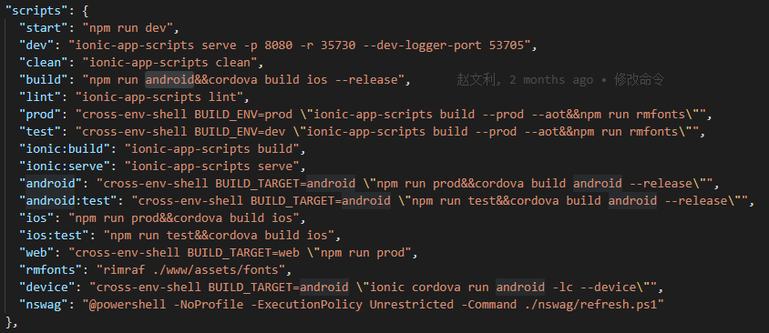

# APP开发上手教程

| 编辑者 | 说明 | 时间 |
| ------ | ---- | ---- |
| 代瓒   |      |      |

## 安装
### 请确保安装了最新的Node和NPM。
### 安装（更新） ionic 命令行工具。
    npm install -g ionic@latest
### 可以使用 *ionic --version* 命令验证安装
### 详细文档可以查看ionic官网<https://ionicframework.com/>
## 入门

### 用 vs code 打开Magicodes.Admin.Core\src\app\ui\App下文件
### 使用vs code 快捷键 *Ctrl+~* 展开命令行，执行以下命令进行包初始化
    npm i
### 输出框没有提示*ERROR*，执行成功，反之则失败。
### 在vs code 终端中输入 *npm start* 在浏览器中启动项目
    npm start
### 我们对ionic命令封装，可以直接使用简单的命令执行：

## 真机调试与打包

### 集成Cordova库到ionic
    npm install -g cordova
