# 部署配置

| 编辑者 | 说明         | 时间     |
| ------ | ------------ | -------- |
| 张吉贵 | 初步编写     | 2018-9-6 |
| 李文强 | 修正语法错误 | 2018-9-7 |

## 说明

本文主要为大家介绍了IIS+Web Deploy远程部署网站

## 后台服务部署

### 服务器配置

* 打开IIS管理器(开始->控制面板->管理工具->IIS管理器)
* 添加网站(右键网站->添加网站)如下图

  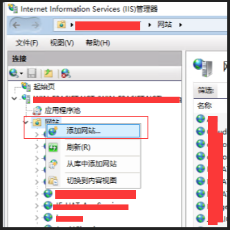
  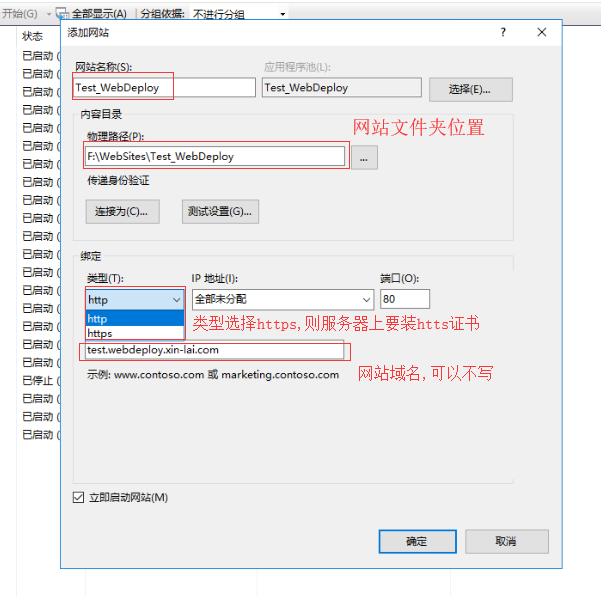
* 选择添后的网站，并赋予相应的IIS用户权限(选择相应的网站->(右侧)管理->IIS管理权限->允许用户->IIS管理器->选择->选择相应的用户->确定)

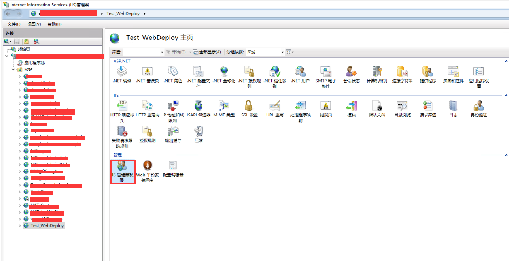
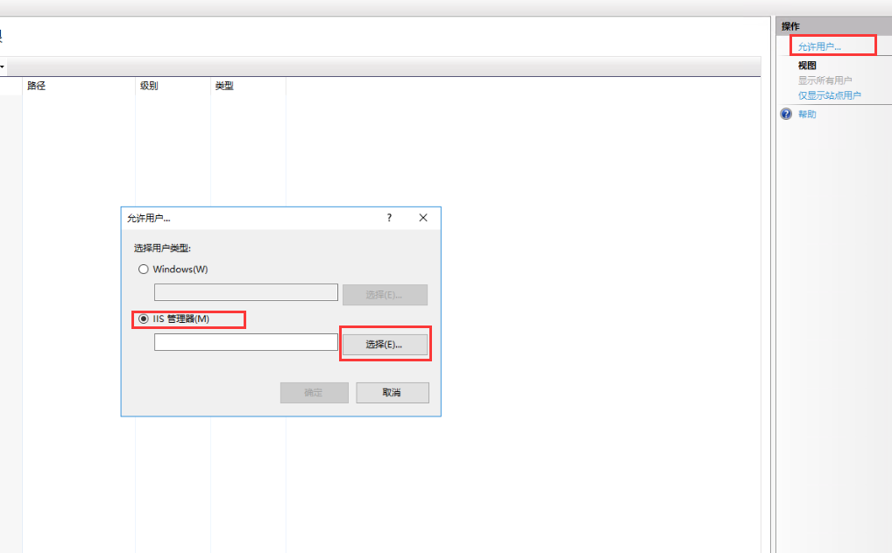
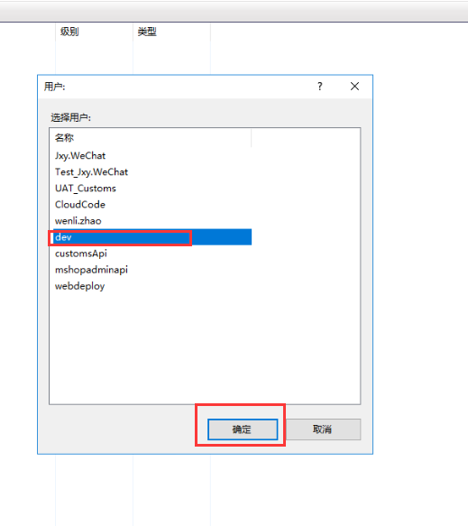

* 给相应的IIS用户赋予权限(选择相应的网站->编辑权限->安全->编辑->添加->高级->立即查找->IIS_IUSRS->选择用户->勾选完全控制)

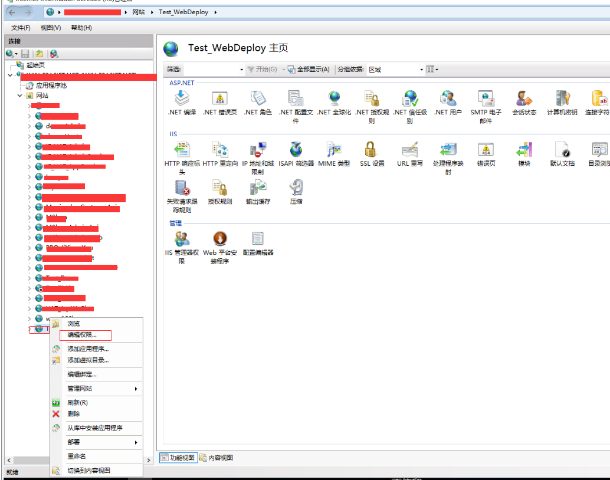
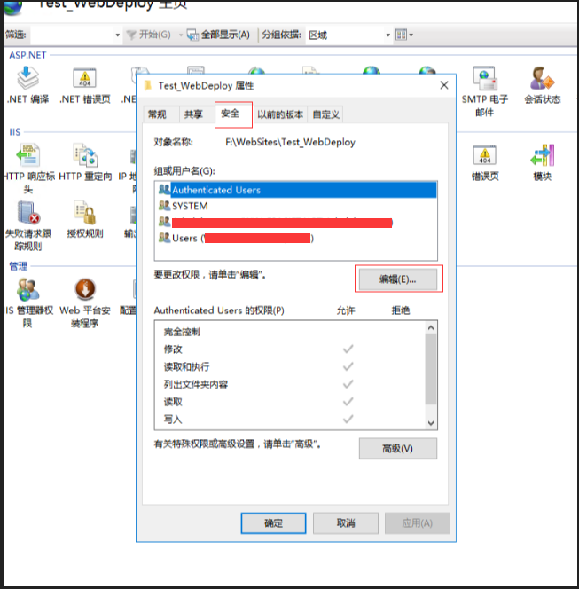
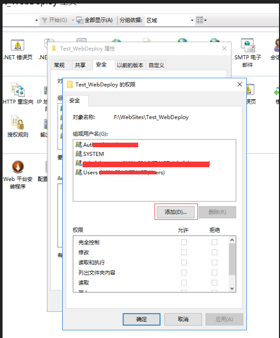
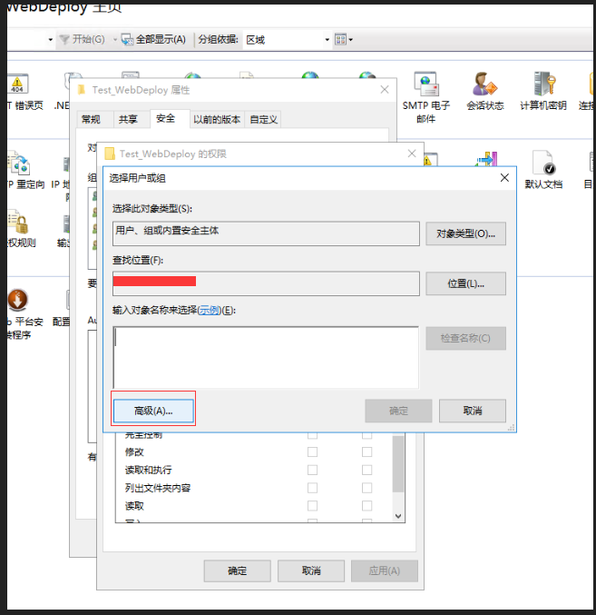
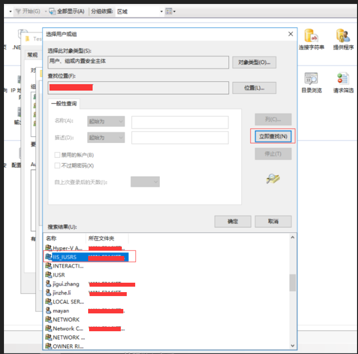
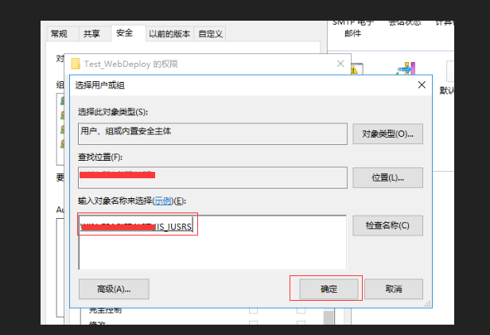
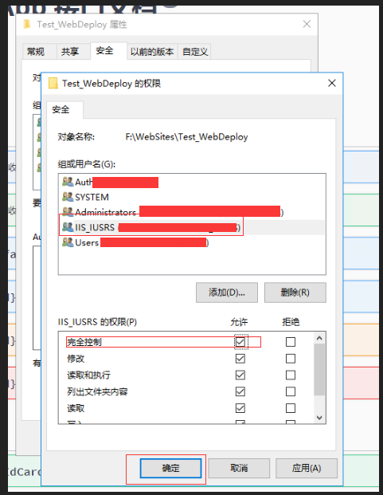

* 启用webDeploy发布(选择相应的网站->启用webDeploy发布->选择IIS用户->确认)

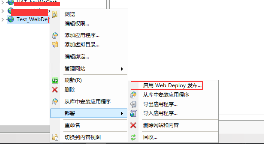
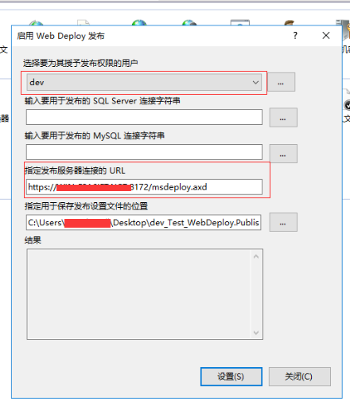

### 本地WebDeploy发布文件配置

* 设置发布项目(将Admin.Host设置为启动项目->右键选择发布->IIS、FTP等->发布->验证连接->下一页->)

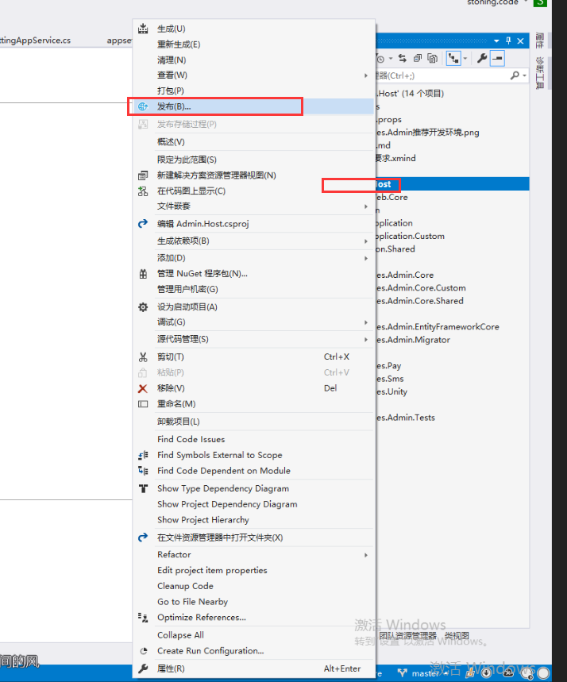
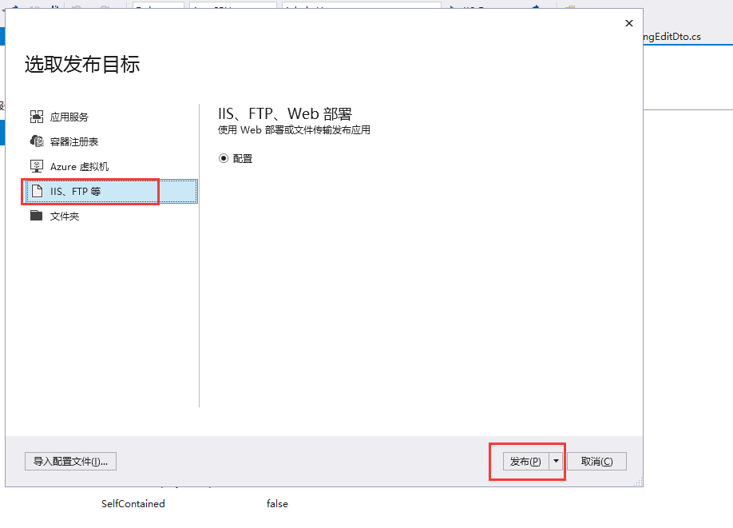
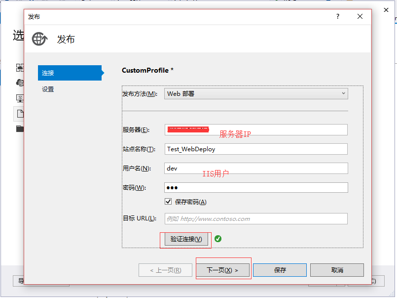

* 运行目标选择：如果目标运行是32位则选择x86，系统也是按照目标运行环境选择分为(win,osx,liunx).
* 目标框架选择：netcoreapp2.1
* 配置：release

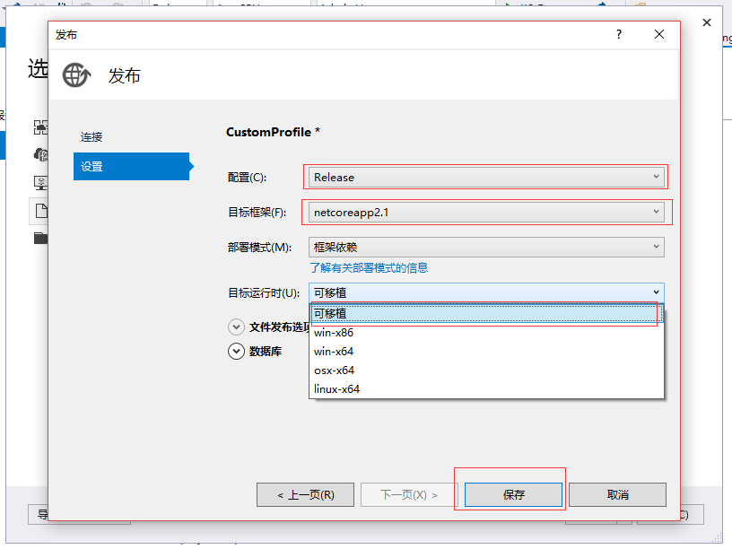

## 前端页面部署

### WebDeploy服务端配置

服务器配置同上

### WebDeploy发布文件配置

* 本脚本使用 msdeploy.exe 进行部署，需要本机安装 web deploy。
* 具体请访问 <https://go.microsoft.com/?linkid=9278654>
* 下载地址：<https://www.microsoft.com/zh-CN/download/details.aspx?id=4148>
* 添加配置文件deploy.config

```示例代码
userName= IIS用户名称(devabcD)
password= IIS用户密码(123456ABcd)
siteName= 站点名称
deployUrl= webDeploy路径(https://test.xin-lai.com:8172/msdeploy.axd)
```

* 执行命令(配置完成后在node控制台执行命令 npm run deploy)

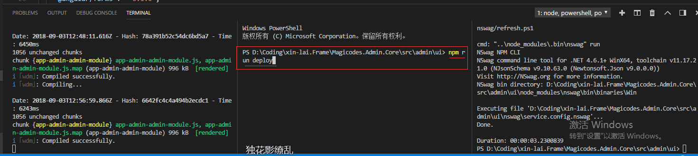
