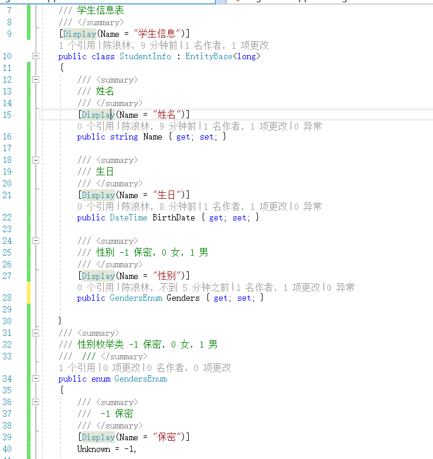
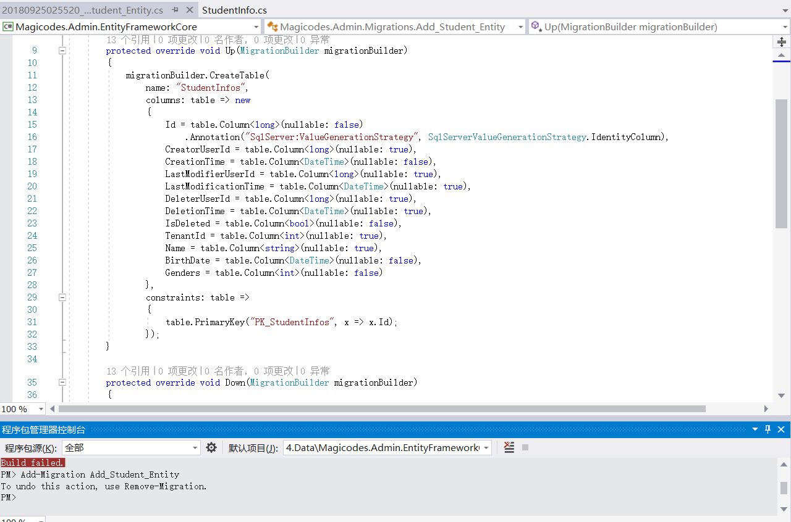

# 数据架构以及数据迁移

| 编辑者 | 说明 | 时间 |
| ------ | ---- | ---- |
| 陈浪林 | 初步编写 | 2018.9.25 | 

## 什么是迁移
开发新应用程序时，数据模型会频繁更改。每当模型更改（添加、删除或更改实体类或更改
DbContext 类）时，使数据库与数据模型保持同步的方式 就叫做迁移。  EF
Core 迁移功能可通过使 EF 更新数据库 架构而不是创建新数据库

## 常用迁移命令
1. Enable-Migrations  启用迁移
2. Add-Migration 将基于自上次迁移创建以来对模型所做的更改来构建下一次迁移
3. Remove-Migration 撤销上一次迁移
4. Update-Database 将对数据库应用任意挂起的迁移

## 添加迁移
1. 定义实体类
    
2. 定义好实体之后，我们就要去DbContext中定义实体对应的DbSet，以应用Code First 数据迁移。找到我们的基础服务层，即以EntityFramework结尾的项目中，找到DbContext类，添加以下代码
    ```
        public virtual DbSet<StudentInfo> StudentInfos { get; set; }
    ```

3. 执行Code First 数据迁移
    *  打开程序包管理器控制台，默认项目选择Entityframework对应的项目后。执行Add-Migration Add_Student_Entity(注:Add_Student_Entity为本次迁移记录的名称，建议简洁明了的表示此次迁移操作对DB的改动)，创建迁移。
    *  创建成功后，会在Migrations文件夹下创建时间_Add_Student_Entity格式的类文件。
    

## 添加数据迁移
*  如果注意观察，我们会发现Migrations文件夹下有个SeedData文件夹，顾名思义，这个文件夹下的类主要是用来进行预置种子数据的。我们可以参照已有类的写法，来预置两条Student。创建DefaultTestDataForStudent类，代码如下：
```
    namespace Magicodes.Admin.Migrations.Seed.Tenants
    {
        public class DefaultTestDataForStudent
        {
            private readonly AdminDbContext _context;

            private static readonly List<StudentInfo> _students;

            public DefaultTestDataForStudent(AdminDbContext context)
            {
                _context = context;
            }

            static DefaultTestDataForStudent()
            {
                _students = new List<StudentInfo>()
                {
                    new StudentInfo(){
                        Name="张三",
                        BirthDate=DateTime.Now,
                        Genders=GendersEnum.Male,
                        CreationTime = Clock.Now,
                    },
                };
            }

            public void Create()
            {
                foreach (var student in _students)
                {
                    if (_context.StudentInfos.FirstOrDefault(t => t.Name == student.Name) == null)
                    {
                        _context.StudentInfos.Add(student);
                    }
                    _context.SaveChanges();
                }
            }
        }
    }
```
* 在SeedHelper类中的SeedHostDb方法中，添加以下代码
```
    new DefaultTestDataForStudent(context).Create();
```

## 执行迁移
在程序包管理器控制台，输入Update-Database，回车执行迁移。执行成功后，查看数据库，StudentInfo表创建成功，且表中已存在测试数据。